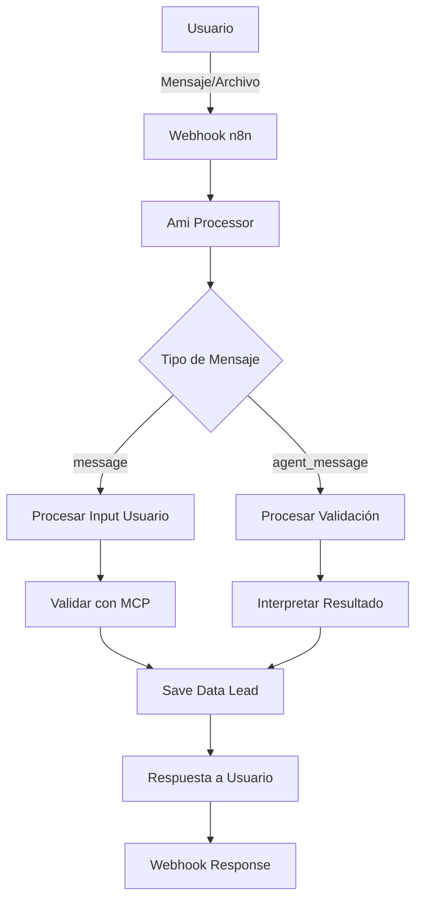

# Ami - Asistente de Recolección de Documentos Habi

<div align="center">
  
  
  **Asistente virtual empático para la recolección de documentos inmobiliarios**
  
  [](https://n8n.io/)
  []()
  []()
</div>

## 📋 Descripción General

**Ami** es un asistente virtual desarrollado en n8n que automatiza la recolección de documentos necesarios para la venta de apartamentos con Habi. Con una personalidad cálida y empática, Ami guía a los usuarios a través de un proceso estructurado para obtener los 4 documentos obligatorios requeridos.

### 🎯 Objetivo Principal
Recolectar de manera eficiente y amigable:
- Datos básicos del vendedor
- Los 4 documentos obligatorios para iniciar la venta

### ✨ Características Principales
- **Interfaz conversacional amigable** con personalidad empática
- **Validación automática de documentos** usando herramientas MCP
- **Flujo de estados estructurado** que garantiza completitud
- **Persistencia de datos** para recuperación de sesiones
- **Feedback en tiempo real** sobre el progreso del usuario

## 🏗️ Arquitectura del Sistema



## 📄 Los 4 Documentos Obligatorios

### 1. 📄 Cédula de Ciudadanía
- **Formato**: Frente y reverso legible
- **Tipos aceptados**: PDF o imagen clara
- **Validación**: `doc_type: 'cedula'`

### 2. 💡 Servicio Público
- **Vigencia**: Máximo 2 meses
- **Requisito**: Debe mostrar dirección del apartamento
- **Tipos**: Luz, agua o gas
- **Validación**: `doc_type: 'servicio_publico'`

### 3. 📜 CTL (Certificado de Tradición y Libertad)
- **Vigencia**: Máximo 30 días (CRÍTICO)
- **Fuente**: Superintendencia de Notariado y Registro
- **Validación**: `doc_type: 'ctl'`

### 4. ✅ Paz y Salvo de Administración
- **Requisitos**: Vigente, con sello oficial y firma
- **Emisor**: Administrador del edificio
- **Validación**: `doc_type: 'paz_y_salvo_admin'`

## 🔄 Flujo de Estados

```
start → lead_basic → doc_cedula → doc_servicio → doc_ctl → doc_pazsalvo → review → done
```

### Estados Detallados:

| Estado | Descripción | Siguiente Estado |
|--------|-------------|------------------|
| `start` | Mensaje de bienvenida | `lead_basic` |
| `lead_basic` | Recolección de datos personales | `doc_cedula` |
| `doc_cedula` | Validación cédula (1/4) | `doc_servicio` |
| `doc_servicio` | Validación servicio público (2/4) | `doc_ctl` |
| `doc_ctl` | Validación CTL (3/4) | `doc_pazsalvo` |
| `doc_pazsalvo` | Validación paz y salvo (4/4) | `review` |
| `review` | Revisión final | `done` |
| `done` | Proceso completado | - |

## 🛠️ Herramientas y Integraciones

### Herramientas MCP Disponibles:

1. **`mcp.validate_lead_fields`**
   - Valida datos básicos del usuario
   - Campos: `full_name`, `phone_e164`, `email`, `address`

2. **`mcp.validate_doc`**
   - Valida documentos subidos
   - Parámetros: `doc_type`, `file`

3. **`Save Data Lead`**
   - Persiste información validada
   - Incluye estado y progreso de documentos

## 📊 Estructura de Datos

### Lead Data Structure:
```json
{
  "lead_id": "string",
  "full_name": "string",
  "phone_e164": "string",
  "email": "string", 
  "address": "string",
  "status": "current_state",
  "documents_status": {
    "cedula": "ok|needs_review|rejected|pending",
    "servicio_publico": "ok|needs_review|rejected|pending", 
    "ctl": "ok|needs_review|rejected|pending",
    "paz_y_salvo_admin": "ok|needs_review|rejected|pending"
  },
  "completion_timestamp": "timestamp",
  "ready_for_human_review": boolean
}
```

## 🚀 Instalación y Configuración

### Prerrequisitos:
- n8n instalado y configurado
- Acceso a herramientas MCP
- Base de datos para persistencia (configurada en n8n)

### Pasos de Instalación:

1. **Importar el workflow de n8n**
   ```bash
   # Importar el archivo JSON del workflow en n8n
   ```

2. **Configurar variables de entorno**
   ```bash
   MCP_API_ENDPOINT=<endpoint_mcp>
   DATABASE_CONNECTION=<connection_string>
   WEBHOOK_URL=<webhook_url>
   ```

3. **Configurar webhooks**
   - Webhook de entrada para mensajes de usuarios
   - Webhook de respuesta para envío de mensajes

4. **Activar el workflow**
   ```bash
   # Activar en la interfaz de n8n
   ```

## 🧪 Testing

### Casos de Prueba Principales:

1. **Flujo completo exitoso**
   - Usuario completa todos los pasos
   - Todos los documentos son válidos

2. **Manejo de errores**
   - Documentos inválidos
   - Datos incompletos
   - Timeouts de validación

3. **Recuperación de sesión**
   - Usuario regresa después de tiempo
   - Continuación desde último estado

### Comandos de Testing:
```bash
# Ejecutar pruebas de integración
npm run test:integration

# Pruebas de validación de documentos  
npm run test:validation

# Pruebas de flujo completo
npm run test:e2e
```

## 📈 Monitoreo y Métricas

### KPIs Principales:
- Tasa de completitud de proceso
- Tiempo promedio de recolección
- Tasa de documentos válidos por tipo
- Abandono por estado

### Logs y Debugging:
- Logs estructurados en n8n
- Tracking de estados por `lead_id`
- Métricas de validación MCP

## 🤝 Contribución

### Estructura del Proyecto:
```
ami/
├── workflows/          # Workflows de n8n
├── docs/              # Documentación
├── tests/             # Casos de prueba
└── assets/            # Recursos y ejemplos
```

### Guías de Contribución:
1. Fork del repositorio
2. Crear rama para feature/bugfix
3. Seguir convenciones de naming
4. Incluir tests para nuevas funcionalidades
5. Actualizar documentación

## 📞 Soporte

### Canales de Comunicación:
- **Issues**: Para bugs y mejoras
- **Discussions**: Para preguntas generales
- **Wiki**: Documentación extendida

### Escalación:
1. Consultar documentación
2. Revisar issues existentes
3. Crear nuevo issue con template
4. Contactar equipo de desarrollo

## 📝 Changelog

### v1.0.0 (Actual)
- ✅ Implementación inicial de Ami
- ✅ Flujo completo de 4 documentos
- ✅ Integración con herramientas MCP
- ✅ Persistencia de datos

### Roadmap:
- 🔄 Mejoras en validación de documentos
- 📱 Integración con WhatsApp
- 🤖 ML para mejor procesamiento de documentos
- 📊 Dashboard de métricas

## 📄 Licencia

Este proyecto está licenciado bajo la Licencia MIT - ver el archivo [LICENSE](LICENSE) para detalles.

---

<div align="center">
  <strong>Desarrollado con ❤️ por el equipo de Habi</strong>
</div>
