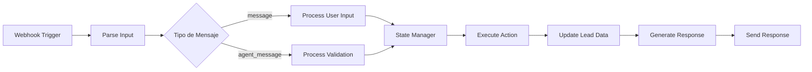

# Guía Técnica del Workflow de n8n - Ami

## 📋 Índice
- [Arquitectura General](#arquitectura-general)
- [Configuración del Workflow](#configuración-del-workflow)
- [Nodos Principales](#nodos-principales)
- [Manejo de Estados](#manejo-de-estados)
- [Validación de Documentos](#validación-de-documentos)
- [Persistencia de Datos](#persistencia-de-datos)
- [Manejo de Errores](#manejo-de-errores)
- [Troubleshooting](#troubleshooting)

## 🏗️ Arquitectura General

### Flujo Principal del Workflow



### Componentes Técnicos

| Componente | Descripción | Tecnología |
|------------|-------------|------------|
| **Trigger Webhook** | Punto de entrada para mensajes | n8n Webhook |
| **Input Parser** | Procesamiento de entrada | JavaScript Code |
| **State Manager** | Control de flujo de estados | Switch Node |
| **MCP Validator** | Validación de documentos | HTTP Request |
| **Data Persistence** | Almacenamiento de datos | Database Node |
| **Response Generator** | Creación de respuestas | Function Node |

## ⚙️ Configuración del Workflow

### Variables de Entorno Requeridas

```javascript
// Configuración en n8n
const config = {
  MCP_API_ENDPOINT: process.env.MCP_API_ENDPOINT,
  DATABASE_URL: process.env.DATABASE_URL,
  WEBHOOK_SECRET: process.env.WEBHOOK_SECRET,
  ADMIN_NOTIFICATIONS: process.env.ADMIN_NOTIFICATIONS
};
```

### Configuración de Credenciales

1. **Base de Datos**
   ```json
   {
     "type": "postgres",
     "host": "{{ $env.DB_HOST }}",
     "port": "{{ $env.DB_PORT }}",
     "database": "{{ $env.DB_NAME }}",
     "username": "{{ $env.DB_USER }}",
     "password": "{{ $env.DB_PASSWORD }}"
   }
   ```

2. **API MCP**
   ```json
   {
     "baseURL": "{{ $env.MCP_API_ENDPOINT }}",
     "apiKey": "{{ $env.MCP_API_KEY }}",
     "timeout": 30000
   }
   ```

## 🔧 Nodos Principales

### 1. Webhook Trigger Node

**Configuración:**
```json
{
  "httpMethod": "POST",
  "path": "/ami-webhook",
  "responseMode": "responseNode",
  "authentication": "headerAuth"
}
```

**Estructura de Input Esperada:**
```json
{
  "lead_id": "string",
  "message": "string|file",
  "agent_message": "validation_result",
  "timestamp": "ISO_string"
}
```

### 2. Input Parser Node (JavaScript)

```javascript
// Código del nodo Input Parser
const inputData = $input.all();
const webhook = inputData[0].json;

// Extraer y validar campos requeridos
const leadId = webhook.lead_id;
const userMessage = webhook.message;
const agentMessage = webhook.agent_message;

// Determinar tipo de mensaje
let messageType;
if (agentMessage) {
  messageType = 'agent_validation';
} else if (userMessage) {
  messageType = 'user_input';
} else {
  messageType = 'invalid';
}

// Preparar datos para siguiente nodo
return [
  {
    json: {
      lead_id: leadId,
      message_type: messageType,
      user_message: userMessage,
      agent_message: agentMessage,
      timestamp: new Date().toISOString()
    }
  }
];
```

### 3. State Manager Node (Switch)

**Configuración de Rutas:**

```json
{
  "rules": [
    {
      "output": 0,
      "operation": "equal",
      "value": "user_input"
    },
    {
      "output": 1, 
      "operation": "equal",
      "value": "agent_validation"
    },
    {
      "output": 2,
      "operation": "equal", 
      "value": "invalid"
    }
  ]
}
```

### 4. Lead Data Retrieval Node (Database)

```sql
-- Query para obtener estado actual del lead
SELECT 
  lead_id,
  full_name,
  phone_e164,
  email,
  address,
  status,
  documents_status,
  created_at,
  updated_at
FROM leads 
WHERE lead_id = $1;
```

### 5. Document Validation Node (HTTP Request)

**Configuración para MCP API:**
```json
{
  "method": "POST",
  "url": "{{ $env.MCP_API_ENDPOINT }}/validate_doc",
  "headers": {
    "Authorization": "Bearer {{ $env.MCP_API_KEY }}",
    "Content-Type": "application/json"
  },
  "body": {
    "doc_type": "{{ $json.doc_type }}",
    "file": "{{ $json.file_data }}",
    "lead_id": "{{ $json.lead_id }}"
  }
}
```

### 6. Response Generator Node (Function)

```javascript
// Generador de respuestas contextuales
function generateResponse(currentState, validationResult, progress) {
  const responses = {
    start: {
      message: "¡Hola! Soy Ami 👋, tu asistente de Habi...",
      next_action: "collect_basic_data"
    },
    lead_basic: {
      message: generateBasicDataRequest(),
      next_action: "validate_basic_data"
    },
    doc_cedula: {
      message: `Perfecto! Ahora necesito tu cédula de ciudadanía 📄\n\nEste es el documento 1 de 4 ✨`,
      next_action: "upload_document"
    }
    // ... más estados
  };
  
  return responses[currentState] || getErrorResponse();
}
```

## 🔄 Manejo de Estados

### Estado Global del Lead

```javascript
// Estructura del estado en base de datos
const leadState = {
  lead_id: "uuid",
  current_state: "doc_cedula", // Estado actual
  basic_data_complete: true,
  documents_status: {
    cedula: "pending|ok|needs_review|rejected",
    servicio_publico: "pending",
    ctl: "pending", 
    paz_y_salvo_admin: "pending"
  },
  progress_percentage: 25, // Calculado automáticamente
  last_interaction: "2024-01-15T10:30:00Z"
};
```

### Transiciones de Estado

```javascript
// Lógica de transición de estados
function getNextState(currentState, validationResult) {
  const stateFlow = {
    'start': 'lead_basic',
    'lead_basic': validationResult.success ? 'doc_cedula' : 'lead_basic',
    'doc_cedula': validationResult.success ? 'doc_servicio' : 'doc_cedula',
    'doc_servicio': validationResult.success ? 'doc_ctl' : 'doc_servicio',
    'doc_ctl': validationResult.success ? 'doc_pazsalvo' : 'doc_ctl',
    'doc_pazsalvo': validationResult.success ? 'review' : 'doc_pazsalvo',
    'review': 'done'
  };
  
  return stateFlow[currentState] || currentState;
}
```

## 📄 Validación de Documentos

### Tipos de Documentos y Validaciones

#### 1. Cédula de Ciudadanía
```javascript
// Parámetros de validación para cédula
const cedulaValidation = {
  doc_type: 'cedula',
  required_fields: ['front_side', 'back_side'],
  file_formats: ['pdf', 'jpg', 'jpeg', 'png'],
  max_file_size: '10MB',
  validation_rules: [
    'readable_text',
    'valid_id_number',
    'not_expired'
  ]
};
```

#### 2. Servicio Público
```javascript
const servicioValidation = {
  doc_type: 'servicio_publico',
  max_age_months: 2,
  required_fields: ['address', 'account_holder', 'service_type'],
  accepted_services: ['electricity', 'water', 'gas'],
  validation_rules: [
    'address_match',
    'not_expired',
    'official_format'
  ]
};
```

#### 3. CTL (Certificado de Tradición y Libertad)
```javascript
const ctlValidation = {
  doc_type: 'ctl',
  max_age_days: 30, // CRÍTICO
  required_fields: ['property_folio', 'owner_info', 'legal_status'],
  issuing_authority: 'superintendencia_notariado',
  validation_rules: [
    'official_seal',
    'valid_signature',
    'property_ownership',
    'no_legal_restrictions'
  ]
};
```

#### 4. Paz y Salvo de Administración
```javascript
const pazSalvoValidation = {
  doc_type: 'paz_y_salvo_admin',
  required_elements: ['official_seal', 'administrator_signature'],
  required_fields: ['property_address', 'account_status'],
  validation_rules: [
    'current_date',
    'administrator_authority',
    'no_pending_fees'
  ]
};
```

### Manejo de Respuestas de Validación

```javascript
// Procesamiento de respuestas del validador MCP
function processValidationResponse(response) {
  const statusMapping = {
    'auto_ok': 'ok',
    'needs_review': 'needs_review', 
    'rejected': 'rejected'
  };
  
  return {
    status: statusMapping[response.status],
    message: response.message,
    confidence: response.confidence,
    issues: response.issues || [],
    next_action: getNextAction(response.status)
  };
}
```

## 💾 Persistencia de Datos

### Schema de Base de Datos

```sql
-- Tabla principal de leads
CREATE TABLE leads (
  lead_id UUID PRIMARY KEY DEFAULT gen_random_uuid(),
  full_name VARCHAR(255),
  phone_e164 VARCHAR(20),
  email VARCHAR(255),
  address TEXT,
  status VARCHAR(50) NOT NULL DEFAULT 'start',
  documents_status JSONB DEFAULT '{}',
  completion_timestamp TIMESTAMP,
  ready_for_human_review BOOLEAN DEFAULT FALSE,
  created_at TIMESTAMP DEFAULT NOW(),
  updated_at TIMESTAMP DEFAULT NOW()
);

-- Tabla de documentos subidos
CREATE TABLE lead_documents (
  id UUID PRIMARY KEY DEFAULT gen_random_uuid(),
  lead_id UUID REFERENCES leads(lead_id),
  doc_type VARCHAR(50) NOT NULL,
  file_path VARCHAR(500),
  file_name VARCHAR(255),
  validation_status VARCHAR(50),
  validation_details JSONB,
  uploaded_at TIMESTAMP DEFAULT NOW()
);

-- Tabla de interacciones (logs)
CREATE TABLE lead_interactions (
  id UUID PRIMARY KEY DEFAULT gen_random_uuid(),
  lead_id UUID REFERENCES leads(lead_id),
  interaction_type VARCHAR(50),
  message_content TEXT,
  response_content TEXT,
  timestamp TIMESTAMP DEFAULT NOW()
);
```

### Queries Principales

```sql
-- Actualizar estado del lead
UPDATE leads 
SET 
  status = $2,
  documents_status = $3,
  updated_at = NOW()
WHERE lead_id = $1;

-- Obtener progreso completo
SELECT 
  l.*,
  COALESCE(
    (
      SELECT json_agg(
        json_build_object(
          'doc_type', doc_type,
          'status', validation_status,
          'uploaded_at', uploaded_at
        )
      )
      FROM lead_documents 
      WHERE lead_id = l.lead_id
    ), 
    '[]'::json
  ) as documents
FROM leads l 
WHERE l.lead_id = $1;
```

## ❌ Manejo de Errores

### Tipos de Errores y Recuperación

#### 1. Errores de Validación
```javascript
// Manejo de errores de validación MCP
const validationErrorHandler = {
  'invalid_format': {
    message: "El formato del archivo no es válido. Por favor, sube un PDF o imagen clara.",
    retry: true,
    max_retries: 3
  },
  'expired_document': {
    message: "El documento está vencido. Necesito uno más reciente.",
    retry: true,
    max_retries: 1
  },
  'unreadable_content': {
    message: "No puedo leer el contenido claramente. ¿Puedes subir una imagen más nítida?",
    retry: true,
    max_retries: 2
  }
};
```

#### 2. Errores de Sistema
```javascript
// Manejo de errores de infraestructura
const systemErrorHandler = {
  'database_timeout': {
    action: 'retry',
    max_retries: 3,
    backoff: 'exponential'
  },
  'mcp_api_down': {
    action: 'fallback',
    fallback_message: "Estoy experimentando problemas técnicos. Un asesor humano te contactará pronto."
  },
  'file_too_large': {
    action: 'user_feedback',
    message: "El archivo es muy grande. Por favor, comprime la imagen o sube un archivo más pequeño."
  }
};
```

#### 3. Recovery Strategies
```javascript
// Estrategias de recuperación
function handleError(error, context) {
  // Log del error
  logError(error, context);
  
  // Estrategia según tipo
  switch(error.type) {
    case 'validation_failed':
      return retryWithGuidance(error, context);
    case 'system_error':
      return gracefulDegradation(error, context);
    case 'user_error':
      return provideFeedback(error, context);
    default:
      return escalateToHuman(error, context);
  }
}
```

## 🔍 Troubleshooting

### Logs y Debugging

#### 1. Logs Estructurados
```javascript
// Formato de logs en n8n
const logEntry = {
  timestamp: new Date().toISOString(),
  lead_id: context.lead_id,
  node_name: context.node.name,
  execution_id: context.execution.id,
  level: 'INFO|WARN|ERROR',
  message: 'Descripción del evento',
  data: {} // Datos contextuales
};
```

#### 2. Monitoreo de Performance
```javascript
// Métricas de performance
const metrics = {
  execution_time: Date.now() - startTime,
  memory_usage: process.memoryUsage(),
  api_calls: {
    mcp_validations: context.mcp_calls,
    database_queries: context.db_queries
  },
  success_rate: context.successful_validations / context.total_validations
};
```

### Problemas Comunes y Soluciones

#### 1. Timeouts de Validación MCP
**Síntoma:** Validaciones que no responden
**Solución:**
```javascript
// Configurar timeout y retry
const mcpRequest = {
  timeout: 30000,
  retry: {
    max_attempts: 3,
    delay: 1000
  }
};
```

#### 2. Estados Inconsistentes
**Síntoma:** Lead en estado incorrecto
**Solución:**
```javascript
// Función de reparación de estado
function repairLeadState(leadId) {
  const documents = getLeadDocuments(leadId);
  const validDocuments = documents.filter(d => d.status === 'ok');
  const newState = calculateStateFromDocuments(validDocuments);
  updateLeadState(leadId, newState);
}
```

#### 3. Pérdida de Sesión
**Síntoma:** Usuario pierde progreso
**Solución:**
```javascript
// Recuperación de sesión
function recoverSession(leadId) {
  const leadData = getLeadById(leadId);
  const lastState = leadData.status;
  const progress = calculateProgress(leadData.documents_status);
  
  return {
    message: `¡Hola de nuevo! Veo que ya completaste ${progress}% del proceso. Continuemos desde donde lo dejamos...`,
    current_state: lastState,
    next_action: getNextActionForState(lastState)
  };
}
```

### Comandos de Mantenimiento

```bash
# Limpiar sesiones expiradas
DELETE FROM leads 
WHERE updated_at < NOW() - INTERVAL '7 days' 
AND status != 'done';

# Verificar integridad de datos
SELECT lead_id, status, documents_status 
FROM leads 
WHERE status = 'done' 
AND (documents_status->>'cedula' != 'ok' 
     OR documents_status->>'servicio_publico' != 'ok'
     OR documents_status->>'ctl' != 'ok' 
     OR documents_status->>'paz_y_salvo_admin' != 'ok');

# Estadísticas de performance
SELECT 
  DATE(created_at) as date,
  COUNT(*) as total_leads,
  COUNT(CASE WHEN status = 'done' THEN 1 END) as completed,
  AVG(EXTRACT(EPOCH FROM (completion_timestamp - created_at))/60) as avg_completion_minutes
FROM leads 
WHERE created_at >= NOW() - INTERVAL '30 days'
GROUP BY DATE(created_at)
ORDER BY date DESC;
```

---

**📧 Para soporte técnico adicional, contactar al equipo de desarrollo con los logs específicos del problema.**
