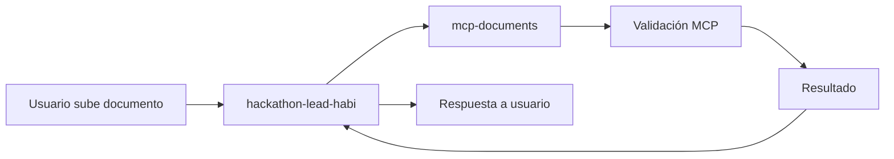

# Descripción de Workflows - Ami Assistant

## 📋 Índice
- [hackathon-lead-habi](#hackathon-lead-habi)
- [mcp-documents](#mcp-documents)
- [Integración entre Workflows](#integración-entre-workflows)
- [Variables Compartidas](#variables-compartidas)

## 🏠 hackathon-lead-habi

### Descripción
Workflow principal que implementa la lógica conversacional de Ami para la recolección de leads y documentos inmobiliarios. Desarrollado durante el hackathon de Habi.

### Funcionalidades Principales
- **Gestión de conversación**: Manejo del flujo conversacional con el usuario
- **Recolección de datos básicos**: Nombre, teléfono, email y dirección
- **Control de estados**: Transición entre los 8 estados del flujo
- **Integración con MCP**: Llamadas al workflow de validación de documentos
- **Persistencia de datos**: Guardado en base de datos PostgreSQL
- **Manejo de errores**: Recovery y reintentos automáticos

### Estados del Flujo
```
start → lead_basic → doc_cedula → doc_servicio → doc_ctl → doc_pazsalvo → review → done
```

### Nodos Principales Esperados
1. **Webhook Trigger** - Punto de entrada para mensajes
2. **Input Parser** - Procesamiento de entrada (message vs agent_message)
3. **Lead State Manager** - Control de flujo basado en estado actual
4. **Basic Data Collector** - Recolección de datos personales
5. **Document Request Generator** - Generación de solicitudes de documentos
6. **MCP Integration** - Llamada al workflow mcp-documents
7. **Response Generator** - Creación de respuestas contextuales
8. **Data Persistence** - Guardado en PostgreSQL
9. **Error Handler** - Manejo de errores y fallbacks

### Estructura de Input Esperada
```json
{
  "lead_id": "uuid",
  "message": "string|file_data",
  "agent_message": {
    "status": "auto_ok|needs_review|rejected",
    "doc_type": "cedula|servicio_publico|ctl|paz_y_salvo_admin",
    "confidence": 0.95,
    "message": "string"
  }
}
```

### Estructura de Output Esperada
```json
{
  "ami_response": {
    "message": "string",
    "next_action": "string",
    "progress": {
      "current_step": "string",
      "completed": 1,
      "total": 4,
      "percentage": 25
    }
  }
}
```

---

## 📄 mcp-documents

### Descripción
Workflow especializado en la validación de documentos usando herramientas MCP (Model Context Protocol). Se encarga de procesar y validar los 4 tipos de documentos obligatorios.

### Funcionalidades Principales
- **Validación automática**: Procesamiento con IA de documentos subidos
- **Análisis de contenido**: Extracción de datos relevantes
- **Verificación de vigencia**: Control de fechas y validez temporal
- **Clasificación de calidad**: Scoring de confianza de validación
- **Feedback estructurado**: Respuestas detalladas sobre estado de validación

### Tipos de Documentos Soportados

#### 1. Cédula de Ciudadanía
- **Formato**: PDF o imagen (frente y reverso)
- **Validaciones**: 
  - Texto legible
  - Número de cédula válido
  - Formato oficial
  - Ambos lados presentes

#### 2. Servicio Público
- **Vigencia**: Máximo 2 meses
- **Validaciones**:
  - Dirección coincidente
  - Fecha dentro del rango
  - Formato oficial (EPM, Codensa, etc.)
  - Datos del titular

#### 3. CTL (Certificado de Tradición y Libertad)
- **Vigencia**: Máximo 30 días ⚠️ CRÍTICO
- **Validaciones**:
  - Sello oficial de notaría
  - Folio de matrícula
  - Información del propietario
  - Estado jurídico del inmueble

#### 4. Paz y Salvo de Administración
- **Validaciones**:
  - Sello oficial
  - Firma del administrador
  - Fecha vigente
  - Dirección del inmueble

### Nodos Principales Esperados
1. **Webhook Trigger** - Recepción de documentos para validar
2. **Document Type Classifier** - Identificación del tipo de documento
3. **File Processor** - Procesamiento de archivos (PDF, imágenes)
4. **MCP API Caller** - Llamada a herramientas de validación
5. **Validation Rule Engine** - Aplicación de reglas por tipo de documento
6. **Confidence Calculator** - Cálculo de score de confianza
7. **Result Formatter** - Formateo de respuesta estructurada
8. **Callback Sender** - Envío de resultado al workflow principal

### Estructura de Input Esperada
```json
{
  "doc_type": "cedula|servicio_publico|ctl|paz_y_salvo_admin",
  "file_data": {
    "content": "base64_encoded_content",
    "filename": "string",
    "mime_type": "string",
    "size": 1024
  },
  "lead_id": "uuid",
  "callback_url": "webhook_url_for_response"
}
```

### Estructura de Output Esperada
```json
{
  "status": "auto_ok|needs_review|rejected",
  "confidence": 0.95,
  "doc_type": "cedula",
  "message": "Documento válido y legible",
  "details": {
    "extracted_data": {
      "document_number": "12345678",
      "name": "Juan Pérez",
      "expiry_date": "2030-12-31"
    },
    "validation_checks": [
      {
        "check": "readable_text",
        "passed": true,
        "confidence": 0.98
      },
      {
        "check": "valid_format",
        "passed": true,
        "confidence": 0.92
      }
    ],
    "issues": [
      {
        "type": "warning",
        "message": "Imagen ligeramente borrosa en esquina"
      }
    ]
  },
  "processing_time": 2500,
  "timestamp": "2024-01-15T10:35:00Z"
}
```

---

## 🔗 Integración entre Workflows

### Flujo de Comunicación



### Secuencia de Llamadas

1. **Usuario sube documento**
   ```json
   {
     "lead_id": "123",
     "message": "cedula_frente_reverso.pdf"
   }
   ```

2. **hackathon-lead-habi procesa y llama a mcp-documents**
   ```json
   {
     "doc_type": "cedula",
     "file_data": "base64_content",
     "lead_id": "123",
     "callback_url": "webhook_hackathon_lead_habi"
   }
   ```

3. **mcp-documents valida y responde**
   ```json
   {
     "status": "auto_ok",
     "confidence": 0.95,
     "message": "Cédula válida"
   }
   ```

4. **hackathon-lead-habi actualiza estado y responde**
   ```json
   {
     "ami_response": {
       "message": "¡Perfecto! Tu cédula está excelente (1/4 documentos completados)",
       "progress": {"completed": 1, "total": 4}
     }
   }
   ```

### Webhook Configuration

#### En hackathon-lead-habi
- **Entrada**: `/webhook/ami-input`
- **Callback MCP**: `/webhook/mcp-callback`

#### En mcp-documents  
- **Entrada**: `/webhook/validate-document`
- **Salida**: Callback al workflow principal

---

## 🔧 Variables Compartidas

### Variables de Entorno Comunes
```bash
# Base de datos
DB_POSTGRESDB_HOST=localhost
DB_POSTGRESDB_DATABASE=ami_assistant
DB_POSTGRESDB_USER=ami_user
DB_POSTGRESDB_PASSWORD=secure_password

# MCP API
MCP_API_ENDPOINT=https://api.mcp-provider.com/v1
MCP_API_KEY=your-mcp-api-key
MCP_TIMEOUT=30000

# Almacenamiento
AWS_S3_BUCKET=ami-documents
AWS_ACCESS_KEY_ID=your-access-key
AWS_SECRET_ACCESS_KEY=your-secret-key

# Webhooks
WEBHOOK_SECRET=your-webhook-secret
```

### Credenciales en n8n
1. **PostgreSQL Database** (compartida)
2. **MCP API Authentication** (compartida)
3. **AWS S3 Storage** (compartida)
4. **Inter-workflow Webhooks** (específicas)

---

## 🧪 Testing de Workflows

### Test de hackathon-lead-habi
```bash
# Test de inicio de conversación
curl -X POST http://localhost:5678/webhook/ami-input \
  -H "Content-Type: application/json" \
  -d '{
    "lead_id": "test-123",
    "message": "Hola Ami"
  }'

# Test de datos básicos
curl -X POST http://localhost:5678/webhook/ami-input \
  -H "Content-Type: application/json" \
  -d '{
    "lead_id": "test-123", 
    "message": "Juan Pérez"
  }'
```

### Test de mcp-documents
```bash
# Test de validación de documento
curl -X POST http://localhost:5678/webhook/validate-document \
  -H "Content-Type: application/json" \
  -d '{
    "doc_type": "cedula",
    "file_data": {
      "content": "base64_encoded_test_document",
      "filename": "test_cedula.pdf",
      "mime_type": "application/pdf"
    },
    "lead_id": "test-123",
    "callback_url": "http://localhost:5678/webhook/mcp-callback"
  }'
```

---

## 📊 Métricas y Monitoring

### KPIs por Workflow

#### hackathon-lead-habi
- Tiempo promedio por conversación
- Tasa de abandono por estado
- Tasa de completitud del flujo
- Tiempo total desde inicio hasta done

#### mcp-documents
- Tiempo promedio de validación por tipo de documento
- Tasa de accuracy por tipo de documento
- Tasa de auto_ok vs needs_review vs rejected
- Distribución de confidence scores

### Logs Estructurados
```json
{
  "timestamp": "2024-01-15T10:35:00Z",
  "workflow": "hackathon-lead-habi",
  "lead_id": "uuid",
  "event": "state_transition",
  "from_state": "doc_cedula",
  "to_state": "doc_servicio",
  "processing_time": 1500
}
```

---

## 🚀 Deployment Considerations

### Orden de Deployment
1. **Desplegar mcp-documents primero** (dependencia)
2. **Verificar conectividad MCP**
3. **Desplegar hackathon-lead-habi**
4. **Ejecutar tests de integración**

### Health Checks
```bash
# Verificar ambos workflows
curl http://localhost:5678/webhook/ami-input -d '{"test":true}'
curl http://localhost:5678/webhook/validate-document -d '{"test":true}'
```

---

**📧 Una vez que tengas los archivos JSON reales de los workflows, reemplaza los placeholders y actualiza esta documentación con los detalles específicos de implementación.**
